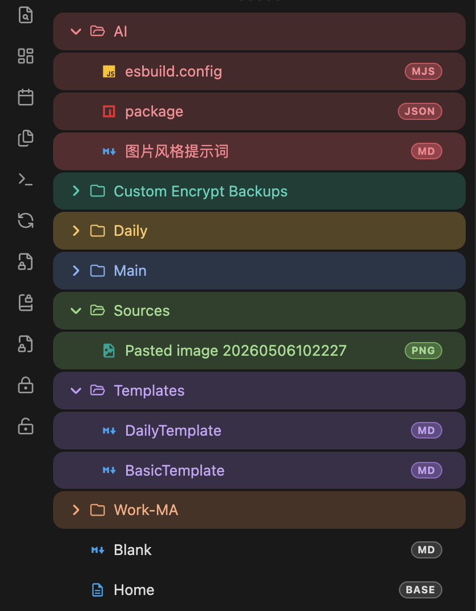
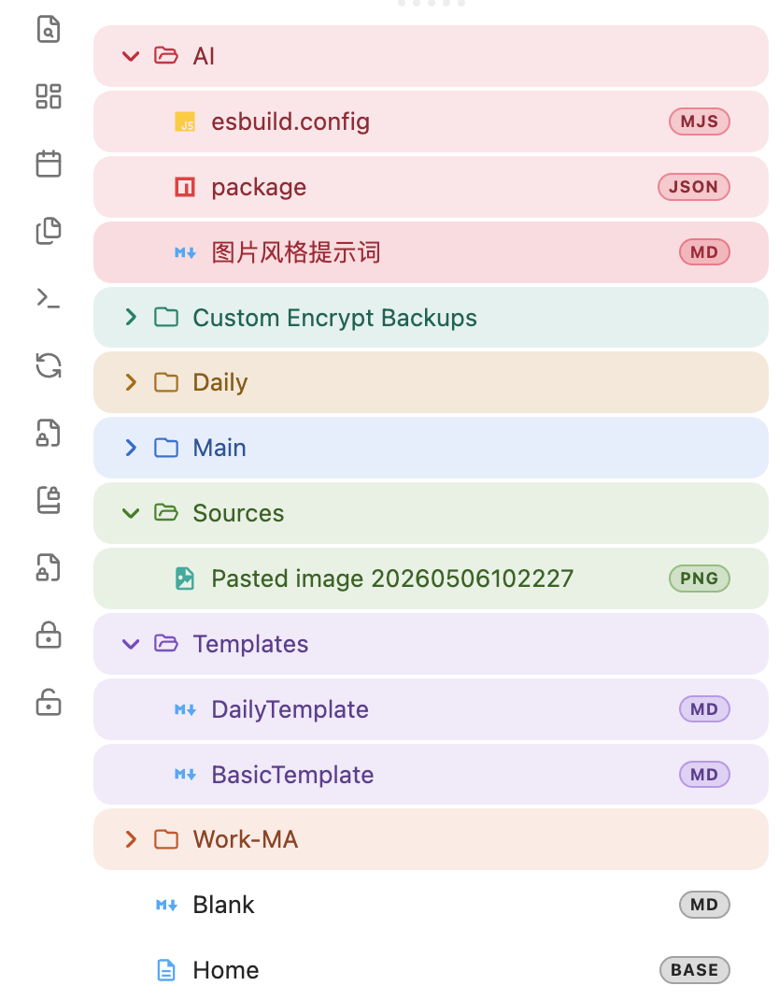
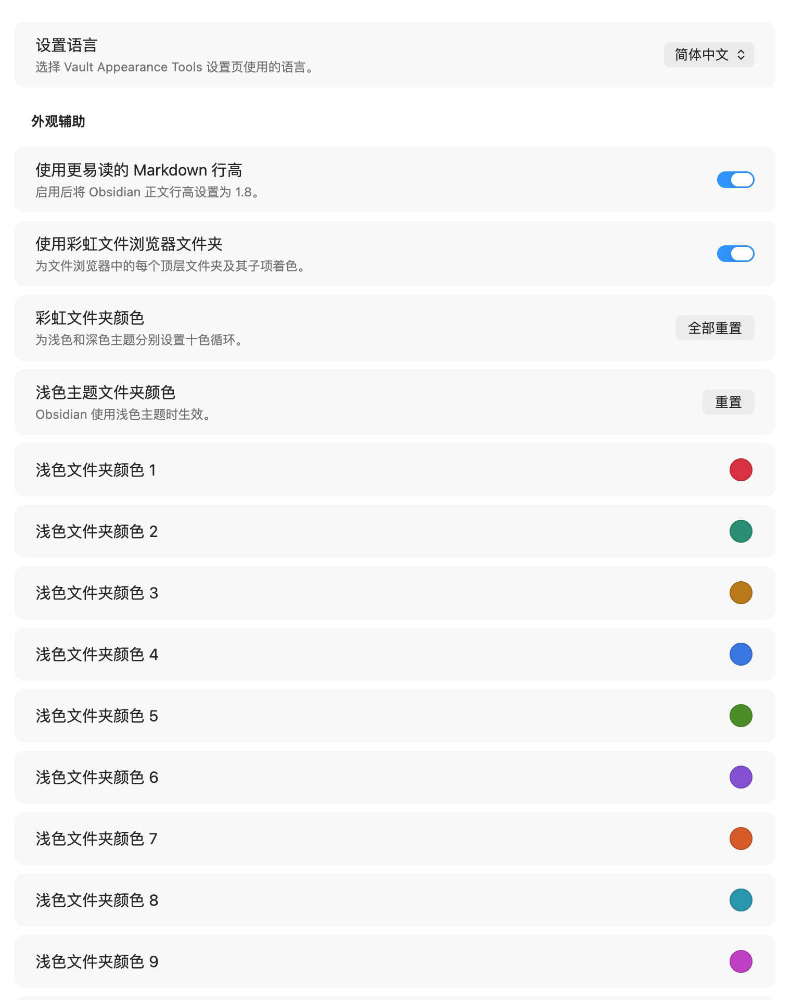
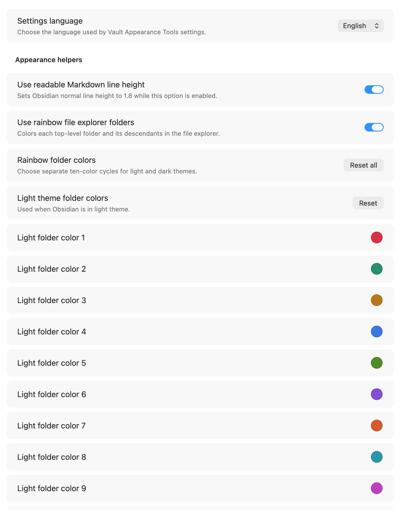

# Vault Appearance Tools

[English](README.md)

Vault Appearance Tools 是一个 Obsidian 外观增强插件，用来把一些常用的库级外观调整集中到一个轻量插件里。

它只处理界面外观，不处理笔记加密、密码缓存、`.cenc` 内容解析或解密内容。

## 功能

- 更易读的 Markdown 正文行高：启用后将 Obsidian 正文行高调整为 `1.8`。
- 彩虹文件浏览器文件夹：按顶层文件夹分配颜色，并让子文件夹和文件继承同一组视觉标识。
- 浅色和深色主题分离配色：可分别设置 10 个浅色主题颜色和 10 个深色主题颜色。
- 文件浏览器类型图标：为 Markdown、JSON、YAML、TOML、脚本、配置、证书、`.cenc` 等常见文件显示类型图标。
- Markdown 扩展名徽标：在文件浏览器右侧显示文件扩展名，便于区分 `.md`、`.mdx`、`.markdown` 等文件。
- 双语设置页：支持 English 和简体中文。

## 截图

### 深色主题文件浏览器



### 浅色主题文件浏览器



### 简体中文设置页



### 英文设置页



## 使用 BRAT 安装

这个插件可以通过 Obsidian 的 BRAT 插件安装和更新。适合在插件进入 Obsidian 社区插件市场前使用。

仓库地址：

```text
https://github.com/rayhashcell/vault-appearance-tools
```

### 第一步：安装 BRAT

1. 打开 Obsidian 设置。
2. 进入「第三方插件」或「Community plugins」。
3. 如果还没有允许社区插件，先关闭受限模式并允许社区插件。
4. 点击「浏览」或「Browse」。
5. 搜索 `BRAT`。
6. 安装 `BRAT`，然后启用它。

### 第二步：通过 BRAT 添加本插件

1. 打开命令面板。
   - macOS：`Command + P`
   - Windows / Linux：`Ctrl + P`
2. 运行命令 `BRAT: Add a beta plugin for testing`。
3. 粘贴仓库地址：

   ```text
   https://github.com/rayhashcell/vault-appearance-tools
   ```

4. 确认添加，等待 BRAT 下载插件。
5. 回到 Obsidian 设置里的「第三方插件」列表。
6. 找到 `Vault Appearance Tools` 并启用。

### 第三步：更新插件

后续更新可以继续通过 BRAT 完成：

1. 打开命令面板。
2. 运行 `BRAT: Check for updates to all beta plugins and UPDATE`。
3. 更新完成后，如果 Obsidian 提示重新加载插件，按提示操作。

如果你想固定在某个版本，可以使用 BRAT 的 release tag 安装方式，并选择类似 `v1.0.0` 这样的版本标签。

参考文档：

- [BRAT Quick Guide](https://tfthacker.com/brat-quick-guide)
- [Obsidian Beta-testing plugins](https://docs.obsidian.md/Plugins/Releasing/Beta-testing%20plugins)

## 手动安装

从 GitHub Release 下载以下三个文件：

- `main.js`
- `manifest.json`
- `styles.css`

然后放入你的 Obsidian 库目录：

```text
<your-vault>/.obsidian/plugins/vault-appearance-tools/
```

重启 Obsidian，或在「第三方插件」页面刷新插件列表，然后启用 `Vault Appearance Tools`。

## 本地开发

安装依赖后运行：

```bash
pnpm run build
```

生产构建会输出到：

```text
dist/vault-appearance-tools-<version>/vault-appearance-tools/
```

## 发布

正式发布通过推送 `v` 前缀的 semver 标签触发，例如 `v1.0.0`。

`Publish GitHub Release` workflow 会构建插件，并从生产构建目录上传以下文件：

- `main.js`
- `manifest.json`
- `styles.css`

## 边界

Vault Appearance Tools 是纯外观插件。它不包含加密逻辑，不缓存密码，不解析 `.cenc` 内容，也不处理解密后的笔记内容。
